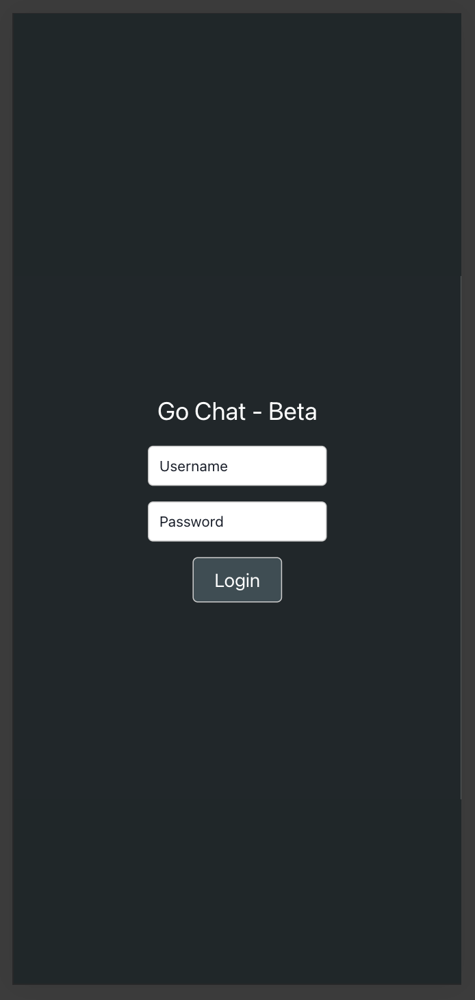
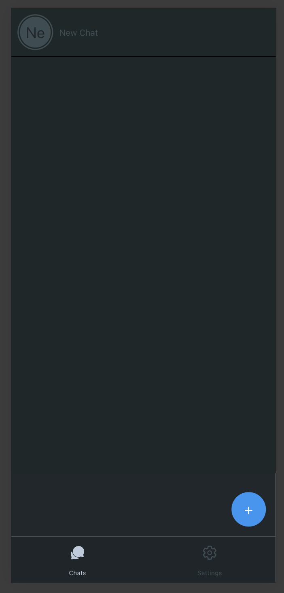
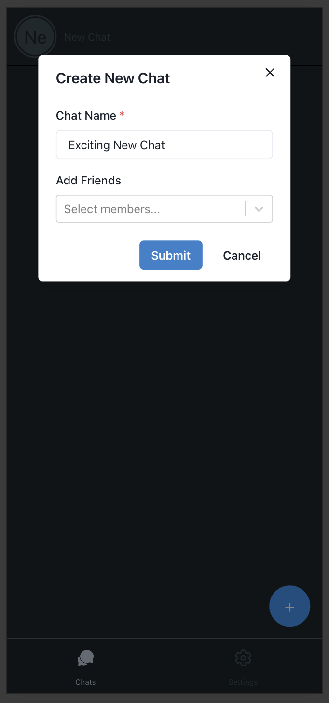
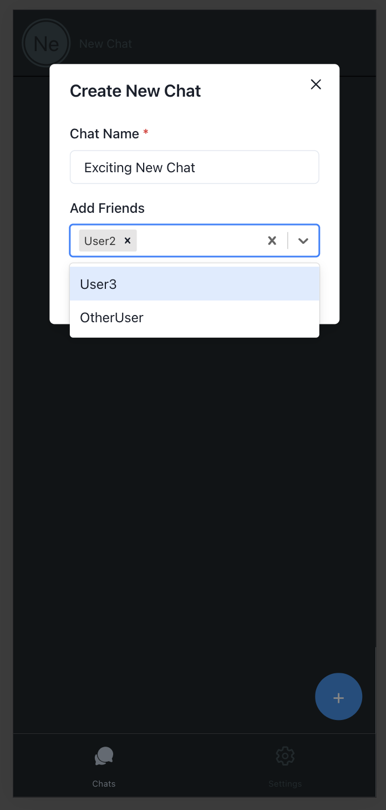
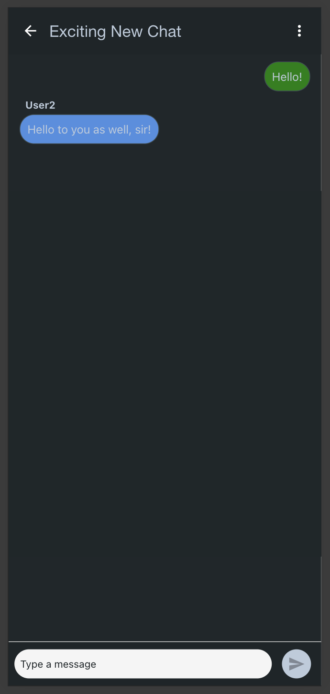
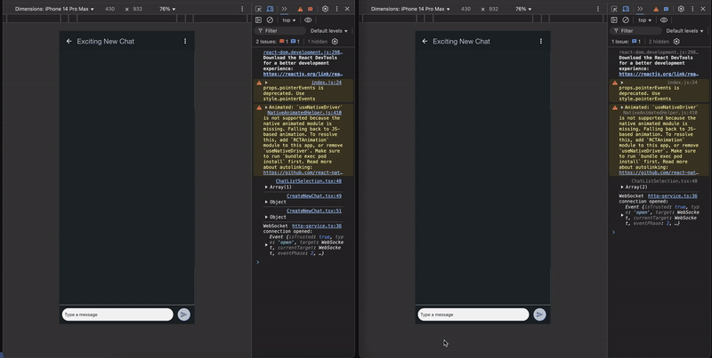

# Go-Chat-Room

## Overview

Go-Chat-Room is a mobile messaging application built with a modern tech stack to provide easy communication between users. It features a user-friendly interface for creating and managing chat groups, sending messages, and interacting with friends in real time.

The front end is built using **React Native**, ensuring compatibility across Android and iOS devices. The back end is powered by **Go** and the **Gin Web Framework**, delivering a high-performance API for managing authentication, chats, and messaging services.

The main purpose of this application was to study not only Go and Gin as the backend technologies and React as the frontend framework, but also to explore the implementation of a small yet efficient WebSocket protocol, enabling users to send and receive messages in real-time.

---

## Features

- **User Authentication:** Secure login system to manage user accounts.
- **Create Chat Groups:** Easily create chat groups by naming them and adding friends.
- **Real-Time Messaging:** Join chat groups and send messages in real-time.
- **Intuitive UI:** Clean and responsive design for smooth user interactions.

---

## Tech Stack

- **Frontend:** React Native
- **Backend:** Go with the Gin Web Framework
- **State Management:** Context API / Async Storage
- **Networking:** REST API
- **Database:** PostgreSQL or any other Go-compatible database (based on deployment)

---

## Screenshots

Below are some key screens showcasing the app’s features:

### Login Page



Description: A simple and secure login interface.

### Chat Selection



Description: This is the main page. View existing chats and create new ones here.

### Create Chat

 

Description: Easily name a chat and invite friends.

### Chat Window



Description: Join conversations and send messages in real-time.

---

## Video Demos



Description: Sending and Receiving messages in real time, between two different users.

---

## Installation

1. Clone the repository:
   ```bash
   git clone https://github.com/pedropds/go-chat-room.git
   cd go-chat-room
   ```
2. Install dependencies for the front end:
   ```bash
   cd go-chat-frontend
   npm install
   ```
3. Start the React Native development server:
   ```bash
   npx react-native run-android # For Android
   npx react-native run-ios # For iOS
   ```
4. Navigate to the backend directory and install dependencies:
   ```bash
   cd go-chat-backend
   go mod tidy
   ```
5. Start the backend server:
   ```bash
   go run main.go
   ```

---

## Usage

- Open the app and log in with your credentials.
- Create a chat by providing a name and selecting friends.
- Join chats and start sending messages.

---

## Future Enhancements

I can foresee several improvements for this app, including:

- **Push Notifications**: Keep users informed in real time, even when the app is in the background.
- **Message Reactions**: Allow users to quickly react to messages with emojis or other indicators.
- **Enhanced Group Chat Features**: Support larger groups with advanced features such as mentions, media sharing, and admin controls.
- **Profile Management**: Enable users to personalize their profiles with photos and settings.
- **Scalability**: Optimize the app architecture to support a growing user base and increased traffic efficiently.

---

## Contributing

Contributions are welcome! Please submit a pull request or open an issue for any feature requests or bugs.

---
